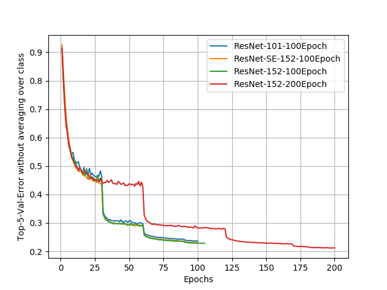

# Benchmark Models for WebVision 2.0 Dataset


## Step-1: Prepare data
The data directory should be prepared following the structure stated in this [link](https://tensorpack.readthedocs.io/modules/dataflow.dataset.html#tensorpack.dataflow.dataset.ILSVRC12). 
We have provided a download + preprocess script for this.
```
cd utils
bash download.sh
```
Note that the server hosting Webvision Data reboots every day at midnight (Zurich time). You might want to change wget to something else. 
## Step-2: Install tensorpack
Following [the instructions here](https://github.com/tensorpack/tensorpack) to install tensorpack. 
```bash
pip3 install tensorpack==0.9.1
```

## Step-3: Train the model (ResNet-50)
Following the setting for ImageNet in tensorpack, we use 4 GPUS with the batch size being set to 64x4=256. Run the following script to train the model, 
```
python3 ./imagenet-resnet.py --data /raid/webvision2018/ --gpu 0,1,2,3 -d 50 --mode resnet
```

## Pretrained models
We offer several pretrained models. **Due to the class imbalance in WebVision, we duplicated the file items in train.txt such that different classes have equal number of training samples. You might want to add similar strategies in imagenet5k.py or modify your own train.txt. Check utils/upsample.py for an example.**

| Model  | Top1-Val-Error | Top5-Val-Error | Download |
| -------- | -------- | -------- | -------- |
| ResNet-50 (101 Epoch)     | 54.28%     | 30.69%     | [link](https://drive.google.com/open?id=12359rElqF1GBLp8AhDPtcV6pdPw9jkbx)
| ResNet-50 (205 Epoch)     | 52.10%     | 28.51%	     | [link](https://drive.google.com/open?id=1Rsf0TFgbC6CmPyQfaBchil_guJxj1MIl)
| ResNet-101 (100 Epoch)     | 52.21%     | 28.62%	     | [link](https://drive.google.com/open?id=1KytIJRV9rqqLhxEOtn9Mc_PsU9seguEZ)
| ResNet-101 (200 Epoch)     | 50.12%     | 26.78%	     | [link](https://drive.google.com/open?id=1PBC6woDWq0NttTSQWiBKZf9rfgyZWbyh)
| ResNet-101 (300 Epoch)     | 48.97%     | 25.74%	     | [link](https://drive.google.com/open?id=1_keTccseVhADGICEQtUNbyDgSIT73Lfw)
| ResNet-101 (500 Epoch)     | 48.38%     | 25.21%	     |  [link](https://drive.google.com/open?id=1060b379OyT3_ELtnUuvlzbT7f36zKngu)
| ResNeXt-101 (100 Epoch)     | 50.62%     | 27.11%	     |  [link](https://drive.google.com/open?id=1UwwsKjdpIQ8X1OkR_Z9yzKEh0_svLR7H)
| ResNet-152 (100 Epoch)     | 51.23%     | 27.80%	     | [link](https://drive.google.com/open?id=1swJnEzn3XIAtpHxwntFx4CyfuSeE_CRa)
| ResNet-152 (200 Epoch)     | 48.98%     | 25.75%	     |  [link](https://drive.google.com/open?id=1DIObpKLyQW01ClwL29psKWBWaYH8fMXD)
| ResNet-152 (300 Epoch)     | 48.05%      |  24.88% |  [link](https://drive.google.com/open?id=1_-_fETYv-z0GWafWmPoqGZ1mlNllXbBS)
| ResNet-152 (500 Epoch)     | 47.31%      |  24.31% |  [link](https://drive.google.com/open?id=1oZnelNCvsW34q1TWnpe_Njoyz1CXxky3)
| ResNet-152-SE (100 Epoch)   | 51.61%     | 28.02%	     | [link](https://drive.google.com/open?id=1Yz1r4-vuEDiGNxzLsh9ULyiqydG85S6m)

Note that here one epoch is defined as an iteration over 1280000 images (ImageNet Epoch), you could divide it by 16M/1.28M to get the Webvision epoch count. Scores are based on validation set, and calculated by utils/eval_score.py using the same metric (Equal weight for each class) as the competition evaluation.

All models are trained from scratch using solely Webvision data. 

## Evaluation and Submission
To generate the prediction files for CodaLab submissions, assume testimages are stored in the above format in /raid/webvision2018_test/val/:
```
python3 ./imagenet-resnet.py --data /raid/webvision2018_test/ -d 50 --mode resnet --eval --load train_log/imagenet-resnet-d50-webvision2018-200epochs/model-1055000

# Preparing the submission file
python3 utils/json2sub.py  
```



Note that the error rate in the above figure is calculated directly over validation set (without averaging over class), and thus not the same metric used by the evaluation system.

## Dependencies
+ Tensorflow
+ Tensorpack
+ opencv-python

## Acknowledgement
The code is adapted from Tensorpack, where we modified the data pipeline for Webvision.

## License 
Apache 2.0

## Disclaimer
The webvision dataset is collected by the learning from web data team at Computer Vision Laboratory, ETH Zurich. The dataset development was supported by Google Research Zuirch. Any opinions, findings, and conclusions or recommendations expressed in this material are those of the author(s) and do not necessarily reflect the views of the funding agencies.

This repository is developed by the learning from web data team at Computer Vision Laboratory, ETH Zurich. Any opinions, findings, and conclusions or recommendations expressed in this material are those of the author(s) and do not necessarily reflect the views of the funding agencies.

